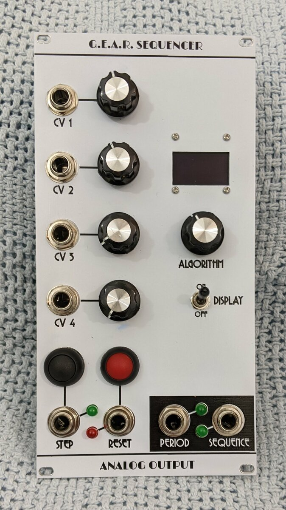
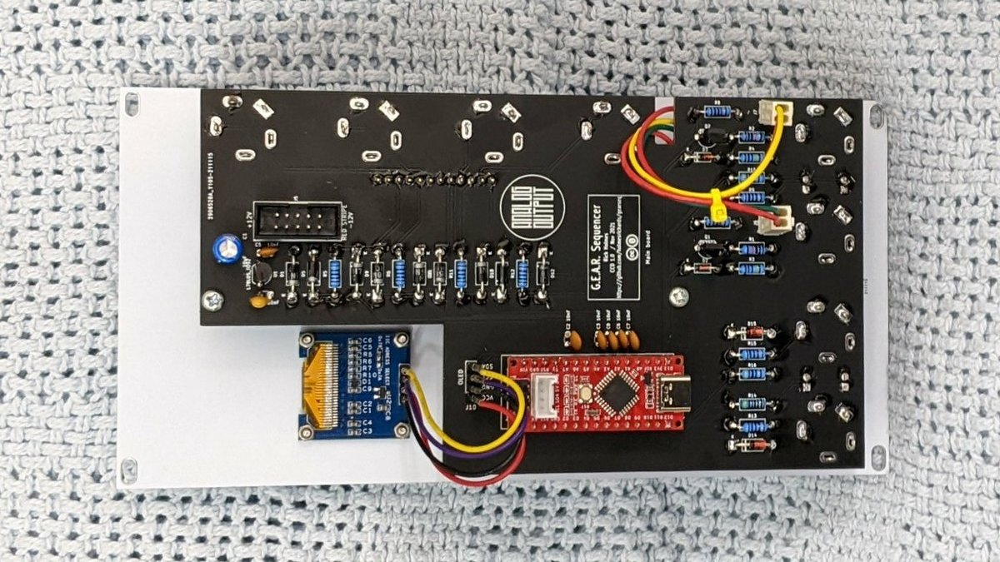

<!-- START doctoc generated TOC please keep comment here to allow auto update -->
<!-- DON'T EDIT THIS SECTION, INSTEAD RE-RUN doctoc TO UPDATE -->
**Table of Contents**  *generated with [DocToc](https://github.com/thlorenz/doctoc)*

- [G.E.A.R. Sequencer](#gear-sequencer)
  - [Algorithms](#algorithms)
  - [Implementation](#implementation)
  - [Pot assignments](#pot-assignments)
    - [Pot+CV 1 and 4](#potcv-1-and-4)
    - [Pot+CV 2](#potcv-2)
    - [Pot+CV 3](#potcv-3)
    - [Parameter ranges](#parameter-ranges)
  - [Usage notes](#usage-notes)
  - [Dependencies](#dependencies)
  - [Submodules](#submodules)

<!-- END doctoc generated TOC please keep comment here to allow auto update -->

# G.E.A.R. Sequencer

This is a voltage controlled trigger sequencer or, perhaps a better term, trigger sequence generator. It can function as a Euclidean rhythm generator, but it can also create other rhythms via different means. It is designed in Kosmo format, though it can be adapted to any other ±12 V or (probably) ±15 V format.

## What it does

Rather than sending triggers in a sequence that is completely specified by the user, the G.E.A.R. Sequencer creates sequences based on user specified parameters.

It offers a choice of four algorithms:

* **G**ap sequence
* **E**uclidean sequence
* **A**DC sequence
* **R**andom sequence

(Hence the name G.E.A.R. Sequencer.) Each algorithm is governed by up to four parameters whose values the user can dial in on potentiometers, or they can be set and dynamically altered using control voltages.

Within limits of program memory and programmer sanity, there is no reason more algorithms could not be added, but these are the four implemented so far.

## Algorithms

**Euclidean sequencing** is familiar and I won't go into the details here — see [http://cgm.cs.mcgill.ca/~godfried/publications/banff-extended.pdf](http://cgm.cs.mcgill.ca/~godfried/publications/banff-extended.pdf) if you need them. The sequence pattern is determined by two parameters: Repetition period (*P*) and number of triggers (*T*). The algorithm distributes the *T* triggers as uniformly as possible among the *P* sequence steps. A third parameter, the offset (*O*), governs not the pattern itself but where the pattern starts/stops relative to where the period starts/stops.

A more novel algorithm is the **gap sequence,** based on the procedure underlying linear scales in tuning theory and the [Three-gap Theorem](https://en.wikipedia.org/wiki/Three-gap_theorem) in mathematics — not that you need to know that. I'm not aware of any prior use of this idea for trigger sequencing although I would be quite surprised if no one else has done it before. In a gap sequence the pattern is defined by three parameters: *P*, *T*, and the generator (*G*). For a given *P* and *T* there is exactly one Euclidean sequence, but there are up to *P*/2 gap sequences corresponding to different generators. Again, the position of the sequence start relative to the period can be specified by *O*. You can find details of the algorithm [here](Docs/gap_sequence.md).

An **ADC sequence** uses a pattern based on digitization of an analog control voltage. You specify *P* and a value to digitize, *V*, as well as, again, *O*. The sequence pattern is the first *P* bits in the digitization of *V*. This is similar to something the Barton Musical Circuits BMC006 Voltage To Rhythm Converter does (though the BMC006 does a lot more with the idea).

A **random sequence** is fairly self explanatory. For a given *P* and *T*, the algorithm distributes *T* triggers randomly within *P* steps. The random pattern is then repeated indefinitely, offset by *O* as with the other types, until a new sequence is requested. Another "parameter" is the throw (*Th*). The value of the throw is not used to determine the pattern, but if it changes, a new random pattern will be chosen.

## Photos





## Documentation

* [Schematic](Docs/gearseq.pdf)
* PCB layout: [front](Docs/gearseq_layout_front.pdf), [back](Docs/gearseq_layout_back.pdf)
* [BOM](Docs/gearseq_bom.md)
* [Build notes](Docs/build.md)
* [Implementation details](Docs/implementation.md)
* [Gap sequence algorithm](Docs/gap_sequence.md)
* [Usage notes](Docs/usage_notes.md)

## GitHub repository

* [https://github.com/holmesrichards/gapseq](https://github.com/holmesrichards/gapseq)

## Submodules

This repo uses submodules aoKicad and Kosmo_panel, providing libraries needed for KiCad. To clone:

```
git clone git@github.com:holmesrichards/gapseq.git
git submodule init
git submodule update
```


Alternatively do

```
git clone --recurse-submodules git@github.com:holmesrichards/gapseq.git
```

Or if you download the repository as a zip file, you must also click on the "aoKicad" and "Kosmo\_panel" links on the GitHub page (they'll have "@ something" after them) and download them as separate zip files which you can unzip into this repo's aoKicad and Kosmo\_panel directories.

If desired, copy the files from aoKicad and Kosmo\_panel to wherever you prefer (your KiCad user library directory, for instance, if you have one). Then in KiCad, add symbol libraries 

```
aoKicad/ao_symbols
Kosmo_panel/Kosmo
```
and footprint libraries 
```
aoKicad/ao_tht
Kosmo_panel/Kosmo_panel.
```
